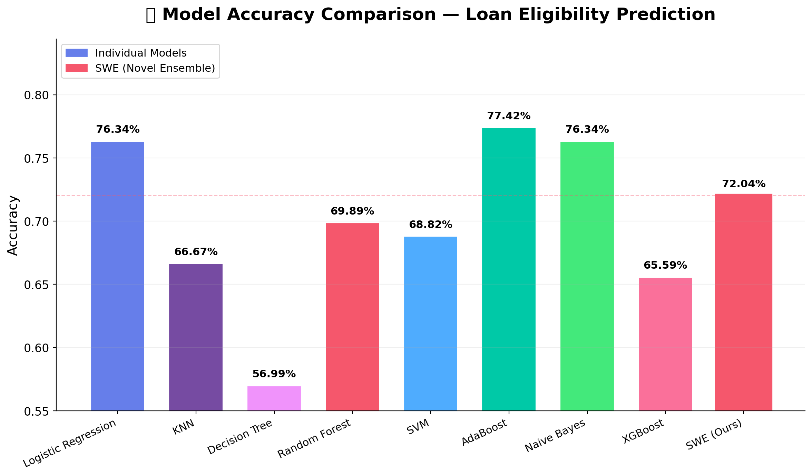
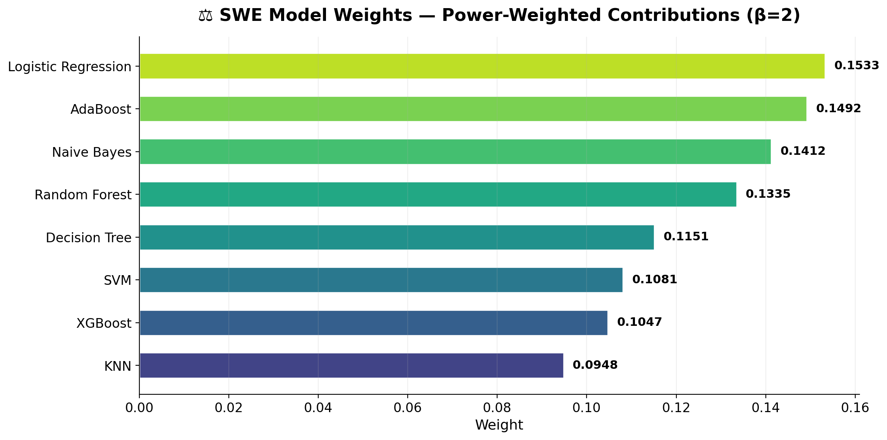
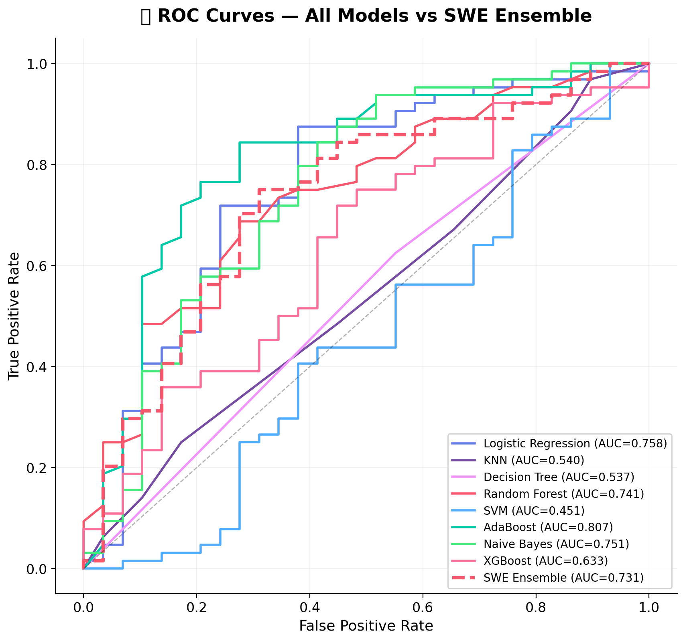
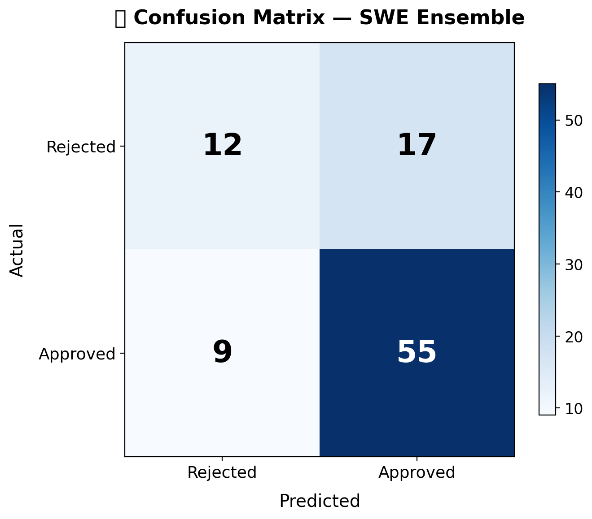
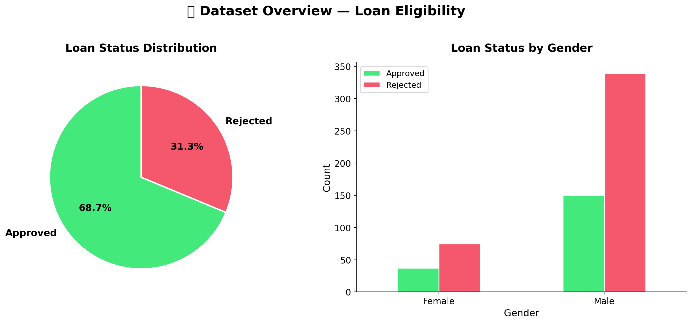
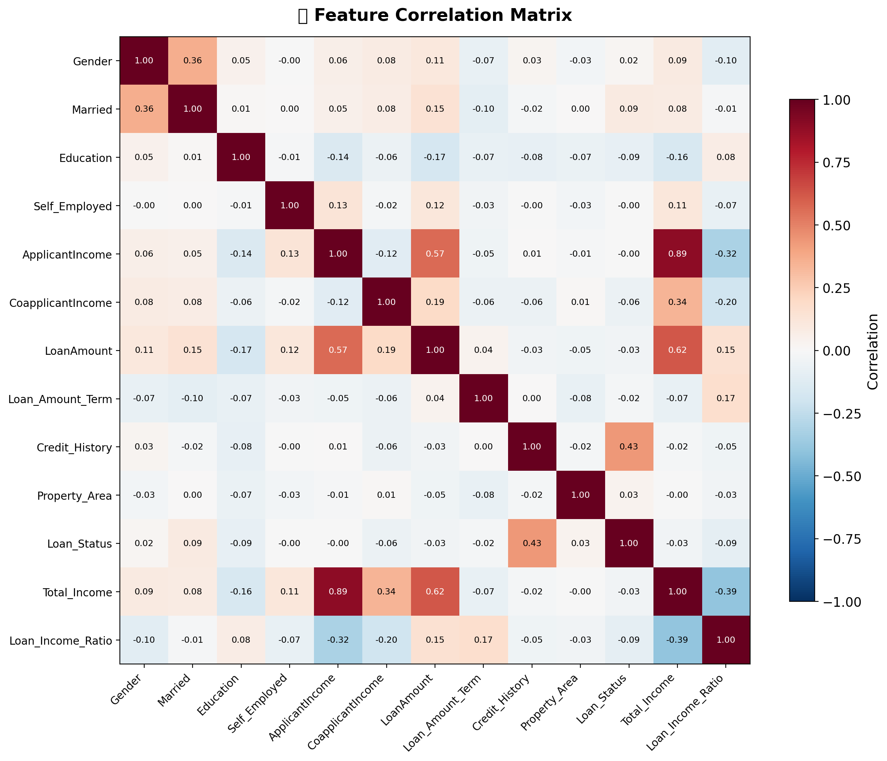
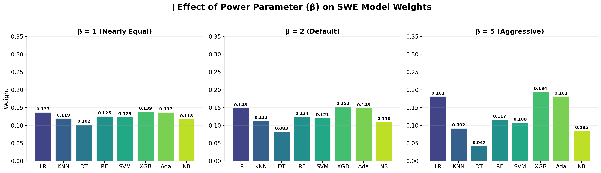
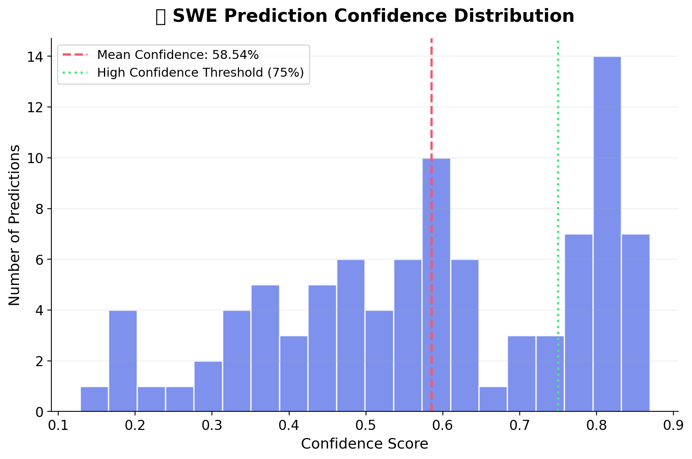
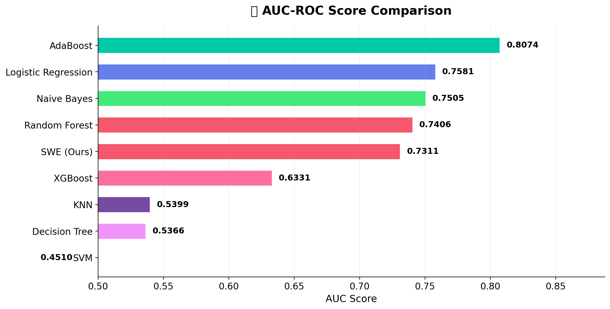
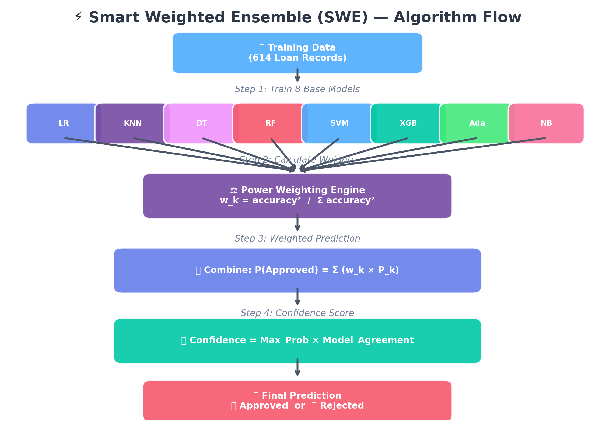

# 📘 Loan Eligibility Prediction — Project Documentation

**Final Year Machine Learning Project**  
**Author:** Krish | **Dataset:** [LoanData.csv](file:///c:/Users/User/Documents/major%20project/LoanData.csv) | **Language:** Python 3

---

## 📂 Project Structure

| File | Role |
|------|------|
| [LoanData.csv](file:///c:/Users/User/Documents/major%20project/LoanData.csv) | Source dataset (614 records, 11 features) |
| [SmartWeightedEnsemble.py](file:///c:/Users/User/Documents/major%20project/SmartWeightedEnsemble.py) | ⭐ Novel SWE algorithm (main contribution) |
| [HierarchicalBayesianTrustEnsemble.py](file:///c:/Users/User/Documents/major%20project/HierarchicalBayesianTrustEnsemble.py) | Advanced HBTE algorithm (research extension) |
| [AdaptiveWeightedEnsemble.py](file:///c:/Users/User/Documents/major%20project/AdaptiveWeightedEnsemble.py) | Early prototype of the ensemble (reference only) |
| `Loan Eligibility Status.ipynb` | Main analysis notebook |
| `Loan Eligibility Status(1st).ipynb` | Original / first-draft notebook |
| [streamlit_app.py](file:///c:/Users/User/Documents/major%20project/streamlit_app.py) | Interactive Streamlit dashboard |
| [test_combos.py](file:///c:/Users/User/Documents/major%20project/test_combos.py) | Hyperparameter combination testing script |
| [requirements.txt](file:///c:/Users/User/Documents/major%20project/requirements.txt) | Python package dependencies |
| `graphs/` | 10 pre-generated visualisation images |
| [SWE_Simplified_Guide.md](file:///c:/Users/User/Documents/major%20project/SWE_Simplified_Guide.md) | SWE algorithm explanation (plain English) |
| [EXPLANATION_SWE_Algorithm.md](file:///c:/Users/User/Documents/major%20project/EXPLANATION_SWE_Algorithm.md) | Detailed SWE write-up |
| [EXPLANATION_HBTE_Algorithm.md](file:///c:/Users/User/Documents/major%20project/EXPLANATION_HBTE_Algorithm.md) | Detailed HBTE write-up |
| [8_Algorithm_Project_Creative_Ideas.md](file:///c:/Users/User/Documents/major%20project/8_Algorithm_Project_Creative_Ideas.md) | Project planning guide |
| [README_PROJECT_SUMMARY.md](file:///c:/Users/User/Documents/major%20project/README_PROJECT_SUMMARY.md) | Quick-start reference guide |

---

## 📊 Dataset — [LoanData.csv](file:///c:/Users/User/Documents/major%20project/LoanData.csv)

| Property | Value |
|----------|-------|
| Records | 614 |
| Features | 11 input + 1 target |
| Target | `Loan_Status` (Y = Approved, N = Rejected) |
| Source | Standard loan eligibility benchmark dataset |

**Features:** `Gender`, `Married`, `Dependents`, `Education`, `Self_Employed`, `ApplicantIncome`, `CoapplicantIncome`, `LoanAmount`, `Loan_Amount_Term`, `Credit_History`, `Property_Area`

---

## 🤖 Algorithms

### Base Classifiers (8)

| # | Algorithm | Type | Key Strength |
|---|-----------|------|-------------|
| 1 | Logistic Regression | Linear | Interpretable baseline |
| 2 | K-Nearest Neighbors | Instance-based | Captures local patterns |
| 3 | Decision Tree | Tree-based | Rule extraction |
| 4 | Random Forest | Bagging Ensemble | Robustness, feature importance |
| 5 | SVM | Kernel-based | Non-linear boundaries |
| 6 | XGBoost | Boosting Ensemble | State-of-the-art performance |
| 7 | AdaBoost | Boosting Ensemble | Sequential error correction |
| 8 | Naive Bayes | Probabilistic | Fast, works with small data |

---

## ⭐ SmartWeightedEnsemble (SWE) — Primary Novel Contribution

**File:** [SmartWeightedEnsemble.py](file:///c:/Users/User/Documents/major%20project/SmartWeightedEnsemble.py)

### Overview
SWE combines all 8 classifiers using power-based dynamic weighting. Better models get exponentially more influence. The algorithm also produces a **confidence score** for every prediction.

### Mathematical Formulas

**Formula 1 — Weight Calculation:**
```
w_k = α_k^β / Σ(α_j^β)
where α_k = validation accuracy of model k, β = 2 (power parameter)
```

**Formula 2 — Weighted Prediction:**
```
P(Approved | x) = Σ(w_k × P_k(Approved | x))
```

**Formula 3 — Confidence Score:**
```
Confidence = P_max × (Models_Agreeing / Total_Models)
```

### Class: [SmartWeightedEnsemble](file:///c:/Users/User/Documents/major%20project/SmartWeightedEnsemble.py#7-160)

```python
from SmartWeightedEnsemble import SmartWeightedEnsemble
```

#### Constructor Parameters

| Parameter | Type | Default | Description |
|-----------|------|---------|-------------|
| `models` | `dict` | required | `{name: sklearn_estimator}` dictionary |
| `power` | `float` | `2.0` | Exponent β for weight amplification |
| `confidence_threshold` | `float` | `0.75` | Threshold for "high confidence" flag |
| `verbose` | `int` | `1` | `0` = silent, `1` = progress output |

#### Methods

| Method | Signature | Returns | Description |
|--------|-----------|---------|-------------|
| `fit` | `fit(X, y, X_val=None, y_val=None)` | `self` | Trains all models and computes weights |
| `predict` | `predict(X, return_confidence=False)` | `ndarray` | Predicts class labels; optionally returns confidence |
| `predict_proba` | `predict_proba(X)` | `ndarray (n, 2)` | Returns weighted class probabilities |
| `explain_prediction` | `explain_prediction(X, idx=0)` | `dict` | Full breakdown of one sample's prediction |
| `get_model_rankings` | `get_model_rankings()` | `list of tuples` | Models sorted by weight descending |

#### Post-fit Attributes

| Attribute | Type | Description |
|-----------|------|-------------|
| `weights_` | `dict` | Normalised weight per model |
| `accuracies_` | `dict` | Validation accuracy per model |
| `classes_` | `ndarray` | Unique class labels seen at fit time |

#### Usage Example

```python
from SmartWeightedEnsemble import SmartWeightedEnsemble
from sklearn.model_selection import train_test_split

models = {
    'Logistic Regression': lr,
    'Random Forest': rf,
    'XGBoost': xgb_model,
    # ... other trained models
}

swe = SmartWeightedEnsemble(models, power=2.0, verbose=1)
swe.fit(X_train, y_train, X_val, y_val)

predictions, confidence = swe.predict(X_test, return_confidence=True)
explanation = swe.explain_prediction(X_test, idx=0)
```

---

## 🏛️ HierarchicalBayesianTrustEnsemble (HBTE) — Research Extension

**File:** [HierarchicalBayesianTrustEnsemble.py](file:///c:/Users/User/Documents/major%20project/HierarchicalBayesianTrustEnsemble.py)  
**Full Explanation:** [EXPLANATION_HBTE_Algorithm.md](file:///c:/Users/User/Documents/major%20project/EXPLANATION_HBTE_Algorithm.md)

### Overview

**HBTE** is your second novel algorithm. Unlike SWE (which uses fixed power-weighted scores), HBTE **learns to trust** models over time — like a bank manager who watches each loan officer's real track record and adjusts confidence accordingly.

**4 Key Innovations:**
1. **Bayesian Trust** — Trust scores update as the system sees more real-world data
2. **Information-Theoretic Confidence** — Uses Shannon entropy to measure uncertainty
3. **Hierarchical 3-Tier Decisions** — Uses fewer models when confident, all models when uncertain
4. **Mathematical Convergence Guarantee** — Proven to converge to optimal trust over time

### Real-World Analogy

> Imagine a Bank Manager with 8 loan officers:
> - **SWE**: "I check everyone's exam score once, and always trust them that much forever."
> - **HBTE**: "I start with exam scores, then **watch real performance**. If an officer keeps getting it right, I trust them more. If they start failing, I reduce their trust."
>
> **AND** HBTE uses a 3-tier system:
> - **Easy case** → Ask only top 3 officers → Fast decision ⚡
> - **Medium case** → Ask top 5 officers → Balanced decision ⚖️
> - **Hard case** → Ask ALL 8 officers → Most thorough decision 🔍

---

### How HBTE Works — Step by Step

#### Phase 1: Training & Initial Trust Setup

1. Split data → 70% training, 15% validation, 15% test
2. Train all 8 models on the training set
3. Evaluate each model on the validation set
4. Compute initial trust using the power formula (same as SWE):
   ```
   α_k = (accuracy_k)^β / Σ (accuracy_j)^β
   ```
5. Initialise Bayesian counters: `successes = 0`, `failures = 0` per model

#### Phase 2: Making a Prediction (Hierarchical)

For each new application, HBTE runs 3 steps:

**Step A** — Ask ALL 8 models to predict and compute trust-weighted probability.

**Step B** — Measure confidence using two components:

| Component | Formula | Meaning |
|-----------|---------|---------|
| Information Confidence | `C(x) = 1 - H(x) / log(2)` | High when models agree strongly (low entropy) |
| Model Agreement | `A(x) = (# agreeing models) / K` | Fraction of models voting with the majority |
| Combined Confidence | `Γ(x) = λ·C(x) + (1-λ)·A(x)` | Final confidence score (λ = 0.6 default) |

**Step C** — Select tier based on Γ(x):

| Tier | Condition | Models Used | Description |
|------|-----------|-------------|-------------|
| Tier 1 ⚡ | `Γ >= 0.80` | Top 3 most trusted | Easy cases — fast auto-decision |
| Tier 2 ⚖️ | `0.60 <= Γ < 0.80` | Top 5 most trusted | Medium cases — balanced |
| Tier 3 🔍 | `Γ < 0.60` | All 8 models | Hard cases — full committee |

#### Worked Example — Information Confidence C(x)

```
Weighted probability from all 8 models:
  P(Approved) = 0.88,  P(Rejected) = 0.12

Shannon Entropy:
  H(x) = -(0.88 × log(0.88) + 0.12 × log(0.12)) = 0.3668

Maximum Entropy (binary): H_max = log(2) = 0.6931

Information Confidence:
  C(x) = 1 - 0.3668 / 0.6931 = 0.4707  (47.07%)
```

#### Worked Example — Combined Confidence Γ(x)

```
C(x) = 0.4707  (entropy-based confidence)
A(x) = 0.75    (6 of 8 models agree → 75%)
λ    = 0.60

Γ(x) = 0.6 × 0.4707 + 0.4 × 0.75 = 0.2824 + 0.3000 = 0.5824
Since 0.5824 < 0.60  →  TIER 3: use ALL 8 models 🔍

Easy case example (very certain):
  C(x) = 0.92, A(x) = 0.875 → Γ(x) = 0.552 + 0.350 = 0.902
  Since 0.902 >= 0.80  →  TIER 1: use TOP 3 models ⚡
```

#### Phase 3: Bayesian Trust Update (Online Learning)

After seeing real loan outcomes, HBTE updates trust for each model:

```
τ_k(t+1) = (s_k + α_k · t₀) / (s_k + f_k + t₀)
```

Where:
- `s_k` = number of correct predictions by model k
- `f_k` = number of wrong predictions by model k
- `α_k` = initial trust (prior belief)
- `t₀` = prior strength (default = 10)

**Worked Example (after 50 real loan outcomes):**

```
Random Forest: s=42, f=8, α=0.16, t₀=10
  τ_RF = (42 + 1.6) / (42 + 8 + 10) = 43.6 / 60 = 0.7267

Naive Bayes:   s=35, f=15, α=0.10, t₀=10
  τ_NB = (35 + 1.0) / (35 + 15 + 10) = 36.0 / 60 = 0.6000
```

Random Forest outperformed Naive Bayes in practice, so its trust rises automatically.

---

### The 5 Mathematical Formulas

| # | Formula | What It Does | Why It's Novel |
|---|---------|-------------|----------------|
| 1 | `α_k = acc_k^β / Σ(acc_j^β)` | Initial trust from validation accuracy | Power-weighted priors |
| 2 | `τ_k = (s_k + α_k·t₀) / (s_k + f_k + t₀)` | Bayesian trust update | Learns from real outcomes |
| 3 | `C(x) = 1 - H(x)/log(2)` | Information-theoretic confidence | Uses Shannon entropy |
| 4 | `A(x) = (# agree) / K` | Model agreement score | Simple consensus measure |
| 5 | `Γ(x) = λ·C(x) + (1-λ)·A(x)` | Combined confidence for tier selection | Drives hierarchical decisions |

---

### Convergence Theorem (Theorem 1)

> **Statement:** As `t → ∞`, the trust parameter `τ_k(t)` converges almost surely to the true accuracy ratio:
> ```
> τ_k(t) → ρ_k / Σ ρ_j
> ```
> where `ρ_k` is the **true accuracy** of model `M_k`.

**Plain English:** Given enough real-world data, HBTE will automatically find the perfect trust score for each model — regardless of what the initial trust was set to.

**Proof Sketch:**
```
By the Law of Large Numbers: s_k / (s_k + f_k) → ρ_k  as  t → ∞
τ_k = (s_k + α_k·t₀) / (s_k + f_k + t₀)
As s_k, f_k → ∞ (t₀ is a fixed constant):
  τ_k → s_k / (s_k + f_k) → ρ_k
After normalisation: τ_k → ρ_k / Σ ρ_j   □
```

---

### SWE vs HBTE Comparison

| Aspect | SWE ⭐ | HBTE 🏛️ |
|--------|--------|---------|
| Weights | Fixed (set once from validation accuracy) | Dynamic (Bayesian updates over time) |
| Models used per prediction | Always all 8 | 3, 5, or 8 — based on confidence tier |
| Confidence formula | `P_max × Agreement` (heuristic) | Shannon Entropy + Agreement (principled) |
| Online learning | No | Yes |
| Convergence proof | No | Yes (Theorem 1) |
| Number of formulas | 3 | 5 |
| Complexity | Simpler, faster, easier to explain | More sophisticated, adaptive |
| Best for | Quick deployment, easy explainability | Production systems, improving over time |

---

### Class: [HierarchicalBayesianTrustEnsemble](file:///c:/Users/User/Documents/major%20project/HierarchicalBayesianTrustEnsemble.py#26-501)

#### Constructor Parameters

| Parameter | Default | Description |
|-----------|---------|-------------|
| `models` | required | `{name: sklearn_estimator}` |
| `beta` | `2.0` | Power for initial trust |
| `prior_strength` | `10.0` | `t₀` — Bayesian prior strength |
| `theta_high` | `0.80` | Tier-1 confidence threshold |
| `theta_med` | `0.60` | Tier-2 confidence threshold |
| `lambda_param` | `0.6` | Weight of info confidence vs agreement in Γ |
| `online_learning` | `True` | Enable trust updates after prediction |
| `verbose` | `1` | Verbosity level |

#### Key Methods

| Method | Description |
|--------|-------------|
| [fit(X, y, X_val, y_val)](file:///c:/Users/User/Documents/major%20project/HierarchicalBayesianTrustEnsemble.py#109-183) | Train base models, initialise Bayesian priors |
| [predict(X, return_confidence=False)](file:///c:/Users/User/Documents/major%20project/HierarchicalBayesianTrustEnsemble.py#220-280) | Hierarchical tier prediction |
| [predict_proba(X)](file:///c:/Users/User/Documents/major%20project/HierarchicalBayesianTrustEnsemble.py#314-339) | Trust-weighted class probabilities |
| [update_trust(X, y_true)](file:///c:/Users/User/Documents/major%20project/HierarchicalBayesianTrustEnsemble.py#343-386) | Online Bayesian trust update with new ground truth |
| [explain_prediction(X, idx=0)](file:///c:/Users/User/Documents/major%20project/HierarchicalBayesianTrustEnsemble.py#415-489) | Full per-sample explanation including tier used |
| [get_tier_statistics()](file:///c:/Users/User/Documents/major%20project/HierarchicalBayesianTrustEnsemble.py#390-411) | Tier usage breakdown over all predictions |

#### Usage Example

```python
from HierarchicalBayesianTrustEnsemble import HierarchicalBayesianTrustEnsemble

models = {
    'Logistic Regression': lr,
    'Random Forest': rf,
    'XGBoost': xgb_model,
    # ... other trained models
}

hbte = HierarchicalBayesianTrustEnsemble(models, beta=2.0, prior_strength=10.0)
hbte.fit(X_train, y_train, X_val, y_val)

predictions, confidence = hbte.predict(X_test, return_confidence=True)
explanation = hbte.explain_prediction(X_test, idx=0)

# Online update after seeing real outcomes:
hbte.update_trust(X_new, y_actual)

# Check tier usage statistics:
tier_stats = hbte.get_tier_statistics()
```

---

### What Makes HBTE Novel (5 Key Points for Viva)

1. **Bayesian Trust Evolution** — Uses Beta-Bernoulli conjugate priors; weights evolve from real outcomes, not just the initial validation score.
2. **Information-Theoretic Confidence** — Uses normalised Shannon Entropy (rigorous, from information theory 1948) instead of a simple heuristic.
3. **Hierarchical 3-Tier Decisions** — Right number of models for each case: fast for easy, thorough for hard.
4. **Mathematical Convergence Guarantee** — Formal proof that trust converges to true accuracy as data grows.
5. **Online Learning** — Continuously improves in production as real loan outcomes are recorded.

---

## 🏛️ AdaptiveWeightedEnsemble (AWE) — Prototype

**File:** [AdaptiveWeightedEnsemble.py](file:///c:/Users/User/Documents/major%20project/AdaptiveWeightedEnsemble.py)

> **Status:** Reference/prototype only. Superseded by SWE.

An earlier, simpler version of the ensemble. Uses `accuracy²` weighting (same idea as SWE) without the configurable power parameter or confidence threshold. Confidence is computed as `0.6 × probability_strength + 0.4 × agreement`.

---

## 📱 Streamlit Dashboard — [streamlit_app.py](file:///c:/Users/User/Documents/major%20project/streamlit_app.py)

An interactive multi-page web app (32 KB) that provides:

- **Dataset Exploration** — distributions, missing values, correlation heatmap
- **Model Training Comparison** — train and compare all 8 classifiers
- **Live Loan Prediction** — input applicant details, get SWE/HBTE prediction with confidence
- **Algorithm Deep Dives** — interactive explanation of SWE and HBTE

**Run locally:**
```bash
streamlit run streamlit_app.py
```

---

## 📈 Pre-generated Visualisations (`graphs/`)

### 1. Model Accuracy Comparison


---

### 2. SWE Model Weights


---

### 3. ROC Curves — All Models


---

### 4. Confusion Matrix (SWE)


---

### 5. Dataset Distribution


---

### 6. Feature Correlation Heatmap


---

### 7. Power Parameter Effect on Weights


---

### 8. Confidence Score Distribution


---

### 9. AUC Score Comparison


---

### 10. SWE Algorithm Flowchart


---

## 📦 Dependencies — [requirements.txt](file:///c:/Users/User/Documents/major%20project/requirements.txt)

```
streamlit>=1.30.0
pandas>=1.5.0
numpy>=1.23.0
plotly>=5.15.0
scikit-learn>=1.2.0
xgboost>=1.7.0
```

**Install:**
```bash
pip install -r requirements.txt
```

---

## 🎓 Viva Q&A Reference

| Question | Key Answer |
|----------|-----------|
| What is your main contribution? | SWE: dynamic power-weighted ensemble with confidence scoring |
| Why 8 algorithms? | Covers all major ML paradigms — linear, tree, kernel, boosting, probabilistic |
| How is SWE different from stacking? | SWE uses transparent formulas; stacking uses an opaque meta-learner |
| What is the confidence score? | `P_max × Model_Agreement` — interpretable and actionable |
| What is HBTE? | Novel ensemble using Bayesian trust, Shannon entropy confidence, and hierarchical 3-tier decisions |
| How is HBTE different from SWE? | HBTE has online Bayesian trust updates, entropy-based confidence, and a 3-tier decision system |
| What are HBTE's 3 tiers? | Tier 1 (top 3 models, Γ >= 0.80), Tier 2 (top 5 models, 0.60-0.80), Tier 3 (all 8, Γ < 0.60) |
| What is the Bayesian update in HBTE? | τ_k = (s_k + α_k·t₀) / (s_k + f_k + t₀) — blends prior belief with observed successes/failures |
| What is Shannon entropy used for? | Measures prediction uncertainty; C(x) = 1 - H(x)/log(2) gives information confidence |
| What is the convergence theorem? | HBTE's trust values provably converge to true model accuracies as real-world data grows |
| What is HBTE's advantage over SWE? | Online learning, entropy-based confidence, hierarchical tiers, and a convergence proof |
| Why use validation set for weights? | Prevents data leakage; weights reflect out-of-sample performance |
